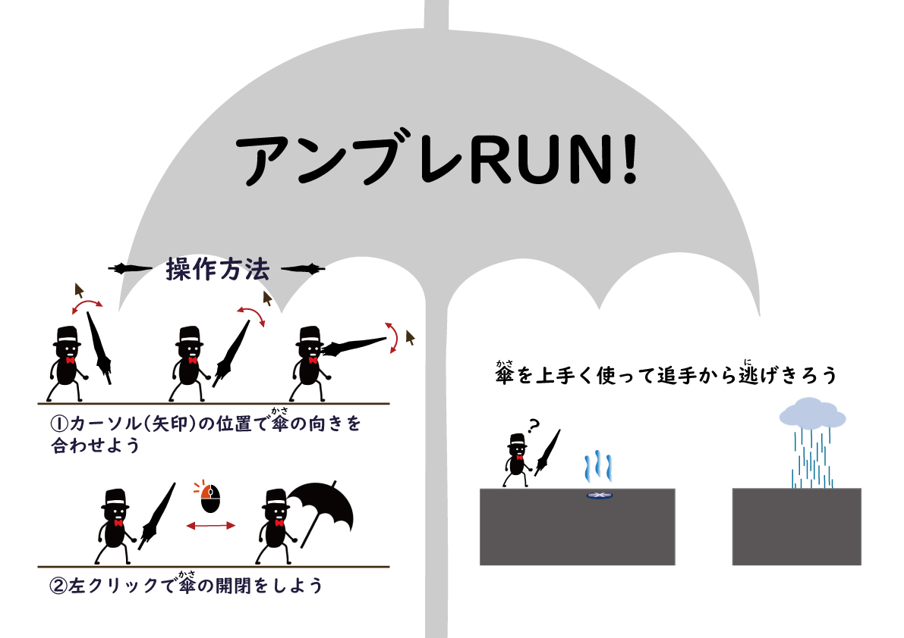

# Umbre-Run <!-- omit in toc -->

## 目次 <!-- omit in toc -->

1. [コンセプト](#コンセプト)
2. [システム](#システム)
3. [クレジット](#クレジット)
	1. [開発メンバー](#開発メンバー)
	2. [アセット](#アセット)
		1. [BGM](#bgm)

## コンセプト

「傘を使ったゲームをつくる」ことをコンセプトに開発しました。

## システム

怪盗であるプレイヤーは傘を開閉したり向きを変えることができるので、ステージ中に登場するギミックに合わせて傘を動かしてゴールを目指します。

ギミッククリアが遅れると、後ろから追いかけてくる警察に捕まりゲームオーバーとなります。

## クレジット

### 開発メンバー

-   プログラム 1 名
-   アニメーション 1 名
-   アーティスト 3 名

### アセット

グラフィック素材はアーティストが作成。

BGM に関してはフリー素材を使用。

#### BGM

通常時 BGM\
https://oo39.com/platinumoo39/bgm,jazz,funky/ys005/

ゲームクリア BGM\
https://www.springin.org/sound-stock/category/bgm/page/2/ \
シューティング 4,5

ゲームオーバー BGM\
https://www.springin.org/sound-stock/category/bgm/page/2/

【Springin’】メインテーマ\
https://www.springin.org/sound-stock/category/bgm/page/3/ \
Lo-Fi1,テクノ 2

ジャンプ音\
https://fc.sitefactory.info/se.html \
ジャンプ 1 ～ 12

雨音 \
https://soundeffect-lab.info/sound/environment/ \
雨が降る 1,2

橋設置 \
https://fc.sitefactory.info/se.html \
パワーアップ 2,4,8,10

逮捕 \
https://otologic.jp/free/se/grab01.html \
掴む音 1 ～ 4

ゴール時ファンファーレ \
https://www.springin.org/sound-stock/category/bgm-short/ \
ジングル 10 ～ 12

走る音 \
https://soundeffect-lab.info/sound/various/ \
革靴で走る,アスファルトの上を走る 1,2
