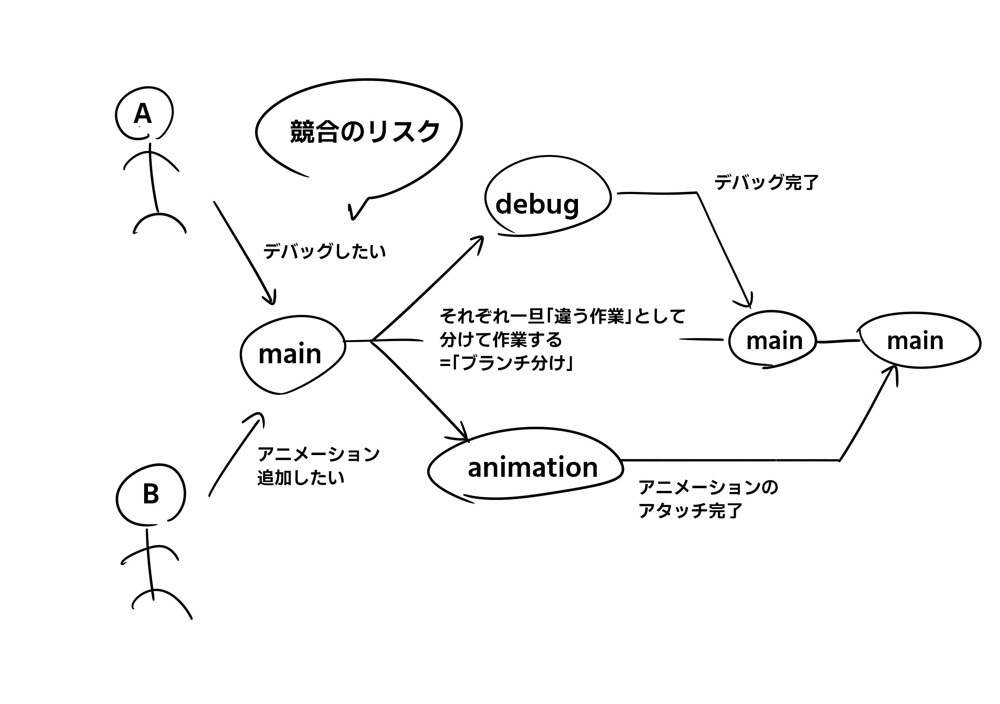
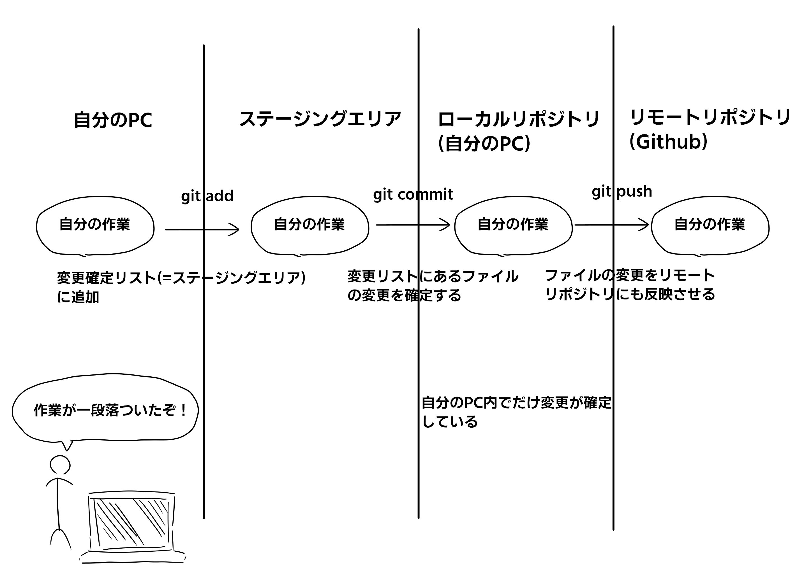

# Umbre-Run
MYU空間情報コンピューティング チームAのコラボレーション用リポジトリ

# Github 使い方

Github ならびに Git は、使い慣れるとチームで作業を共有できたり違う PC からも作業をできたりしてめちゃ便利なんですが、なれるまでがまじでしんどいので、少しでも使いやすくなるようマニュアルを作成しました。\
これを読んでもわからないときはなかむらとか知ってそうな人に聞いてください。\
質問してもらえるとこのマニュアルをさらにわかりやすいものに修正できてありがたいので遠慮なく。

## 目次

- [Github をはじめる前に][0]
- [Github からプロジェクトを持ってくる][1]
- [自分で作業するための環境をつくる][2]
- [作業したものを Github にあげる][3]
- [おまけ][4]

[0]: #github-をはじめる前に
[1]: #github-からプロジェクトを持ってくる
[2]: #自分で作業するための環境をつくる
[3]: #作業したものを-github-にあげる
[4]: #おまけ

## Github をはじめる前に

Github を使う前に下準備が必要なのでそれだけ済ませましょう

1. [Git bash][5] のインストール
2. [Github][6]アカウントの作成
3. [Unity][7] のインストール
   - Unity エディター ver2022.3.11f1 のインストール
4. エクスプローラーの「表示」>「表示」>「隠しファイル」にチェックを入れる[(参考)][8]

[5]: https://git-scm.com/downloads
[6]: https://github.com/
[7]: https://unity.com/ja/download
[8]: https://www.fmworld.net/cs/azbyclub/qanavi/jsp/qacontents.jsp?PID=8511-2971

## Github からプロジェクトを持ってくる

まずはコマンドだけ(#の行はコメント。実際のコマンドには関係のない部分です)

```git
# 任意のフォルダをつくって、そのフォルダの中でGit Bashを開く
git init
git remote add origin (Githubの「code」のところを押すと出てくるURL)
git config user.name (Githubアカウントの名前)
git config user.email (Githubアカウントのメアド)
git branch -m main
git pull origin main
```

### コマンド解説

```git
# 任意のフォルダをつくって、そのフォルダの中でGit Bashを開く
git init
```

フォルダはつくれると思います。\
作ったフォルダを shift + 右クリック すると、"Open Git Bash here"という欄があると思うので、それをクリックすると、今作ったフォルダの位置で Git Bash を開くことができます。\
次にやっている`git init`は、「このフォルダを Git の管理下に置きますよ」的な呪文だと(個人的に)思ってます

```git
git remote add origin (Githubの「code」のところを押すと出てくるURL)
```

今つくったフォルダと、Github に上がっているプロジェクトを繋げるコマンドです。\
これをすることで、Github のプロジェクトを自分のフォルダに落としたり、逆に自分の PC で行なった編集を Github のプロジェクトに反映させることができるようになります。

```git
git config user.name (Githubアカウントの名前)
git config user.email (Githubアカウントのメアド)
```

Github に接続するにあたって、Github のアカウントが認証情報に必要なので、それを入力します。Github アカウントがないとできません。\
余談ですが、`config`のあとには`--global`や`--local`といったオプションを付けることが可能で、`--global`なら全てのフォルダの、`--local`なら今いるフォルダ上の設定をいじることが可能です。\
`git config --local user.name (Githubアカウントの名前)`とした場合、今いるフォルダ内のユーザーネームだけを設定することができます。

```git
git branch -m main
```

自分の今いる「ブランチ」の名前を"main"に変更します。\
ちょっとこれをする前に、CLI の右側を見ていただきたいのですが、(master)とないでしょうか？始めに`git init`した時点では`master`という名前でブランチがつくられるのですが、慣習的に`main`に直して使うことが多いです。\
「ブランチ」は後でまた使う概念なので、とりあえずそういうものがあることだけ覚えておいてください。

```git
git pull origin main
```

これが本命。\
Github のプロジェクトを自分のフォルダに落とすコマンドです。`git pull (リモートリポジトリの名前) (ブランチ名)`という文法になっています。\
今回の Umbre-Run のリモートリポジトリ名は`origin`で、入れたいプロジェクトのブランチが`main`なので、`git pull origin main`というコマンドになります。

ここまで読んで理解できたらやってみてください。分からなかったらなかむらあたりに質問してくれれば多分答えます。

## 自分で作業するための環境をつくる

### コマンド

```git
git branch (作業用ブランチの名前)
git branch
git checkout (さっき作ったブランチ)
```

### 解説

自分で作業するには「ブランチ」をつくります。\
Git のとくにわかりにくい要素「ブランチ」ですが、ざっくりいうと「開発のバージョン分け」みたいな機能です。\
ブランチが役に立つのは、今回のようなチーム作業です。



上図のように、複数の人がそれぞれしたい仕事があるけれど、一度に同じ作業に編集を加えると、お互いの編集が競合を起こす可能性があるので、それを回避しつつも自分の仕事をするために「ブランチ分け」があります。\
それぞれの仕事用にブランチを分けて、それが完了したら本命の main ブランチに変更を適用する、という流れで作業を進めていきます。

```git
git branch (作業用ブランチの名前)
```

ブランチを作っています。(作業用ブランチの名前)の部分に、まだ存在していない名前を入力すると、その名前のブランチを作ってくれます。(ex. `git branch animation`で`animation`ブランチができる。すでにある場合は無効になる)

```git
git branch
```

先程と同じコマンドですが、後ろに何も書かないで実行すると、今自分の PC に存在するブランチの一覧が表示されます。これで先程作ったブランチがちゃんと存在していることを確認すると確実です。\
もし CLI の見た目が変わった場合は、esc キーを押してから`wq`と押すともとに戻すことができます

```git
git checkout (さっき作ったブランチ)
```

このコマンドで、任意のブランチに移動することができます。移動すると、先程 main とか master とかの話をしたと思うのですが、そこの表記が移動したブランチの名前に変わっていると思います。

これで自分の作業用ブランチに移動することが出来ました。次のアップ作業を間違えなければ、いくら編集してもチームに迷惑はかからないので、いくらでも編集してグッチャグチャにしましょう！

## 作業したものを Github にあげる

### コマンド

```git
git status # addしなければいけないファイルがあるか確認
git add .
git commit -m "(どんな編集をしたか書く。日本語でOK)"
git push origin (今いるブランチ)
```

### 解説



Git を使い始めた当初は、「add、commit、push とか、なんでファイルを保存するだけでこんなに手間がかかるんだよ」ってなると思います。めんどくさいんですけど、ちゃんと理由はあります……\
Git はもともと自分の作業履歴を「バージョン」として管理するツールでして、例えば最新の作業でプロジェクトがグッチャグチャになってしまったときに、一つ前のバージョンに戻ることで作業をリセットして改めて作り直すことが、Git では可能です。\
add、commit までは自分の PC 内で、現状の編集を最新バージョンとして保存しており、push によって最新バージョンをリモートの Github にあげている感じです。

```git
git status
```

前回の commit から比較して、変更のあったファイルを確認できます。このコマンドで表示されるメッセージに、「commit したいファイルがあったら git add <commit したいファイル>してね～」っていうメッセージが出てきます

```git
git add .
```

ファイルをステージングエリアに追加することができます。add の後ろのドット . は、add コマンドで使えるオプションの一つで、「add できるやつ全部」って意味があります。とりあえず全部 add したいときはドットにしましょう

```git
git commit -m "(どんな編集をしたか書く。日本語でOK)"
```

ステージングエリアに上がっているファイルの変更を確定させます。その際、「コミットメッセージ」といって、「どんな内容の編集をしたのか」といったメッセージを残します。日本語でいいです。`git commit`とだけコマンドを打つと、その後画面が変わって、コミットメッセージを入力させられますが、`-m`オプションつけておくことで、`git commit`のコマンドを打つ時点でコメントも入力することができます。

```git
git push origin (今いるブランチ)
```

とうとう最後です。commit した作業内容を Github に反映させます。\
`origin`というのはリモートリポジトリの名前だそうで、つまり Github においてあるプロジェクトの名前は origin だということですね。ここはなかむらもよく分かっていません。\
その後ろに作業を反映させたいブランチ名を入力します。ここを main とすることもできるのですが、そうすると本命のプロジェクトデータが上書きされて、場合によっては既に他の人がやっていた作業が消し飛びます。やめましょう。\
まとめると、「Github の origin っていうリポジトリの(今いるブランチ)っていうブランチに今の作業を反映させてください」っていう処理になります。

ここまでできたら、あなたも立派な Git ユーザー！

## おまけ

- コミット(commit) …… 大前提として git はバージョン管理ツール。commit によって、自分がプロジェクトに対して行った変更を正式に適用できるって感じ。
- プッシュ(push) ……リモートリポジトリ(ようは Github)に、自分の変更を適用させること\
- git add …… プロジェクトの変更を、ローカル環境の「変更適用しますリスト」に追加する
- git commit …… 〃、ローカル環境の変更に正式に適用する
- git push …… 〃、オンライン環境に正式に適用する
- ステージングエリア…… 自分の PC で行なった編集作業を確定させるまえに、作業を確定させたいファイルを乗せて(ステージさせて)おく場所。ここに乗せたファイルの編集が、あとのコマンドで確定する

って感じだと思う。(違ってたら容赦なく書き換えオナシャス)
